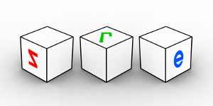

# sre
sre is a simple game engine based on OpenGL and SDL2.



sre currently supports:
- Game Objects and Components
- Model loading (through Assimp)
- Scene Graph
- Event Listener
- Skeletal Animation
- Post processing effects: FXAA, SSAO, Motion Blur, Gamma Correction and Tone Mapping, Bloom
- Bump Mapping
- Shallow water rendering
- Particle Systems
- PBR Materials.

## A working example
``` cpp
int main(int argc, char* argv[]) {
    Engine::init(); // init engine

    Engine::renderSys.createWindow(1920, 1080); // create a window

    // add effects
    Engine::renderSys.effectManager.enableEffects();
    Engine::renderSys.effectManager.addEffect(std::make_shared<FXAA>());
    Engine::renderSys.effectManager.addEffect(std::make_shared<MotionBlur>());
    Engine::renderSys.effectManager.addEffect(std::make_shared<Bloom>());
    auto gammaPost = std::make_shared<GammaCorrection>();
    gammaPost->setGamma(1.8f);
    gammaPost->setExposure(1.0f);
    Engine::renderSys.effectManager.addEffect(gammaPost);

    // Create a camera
    auto camera = Engine::gameObjectManager.createGameObject();
    camera->name = "camera";
    camera->transform.moveBy(glm::vec3{0.0f, 0.0f, 30.0f});                             // set the camera position
    camera->transform.setRotation(glm::quat{ glm::vec3{0, glm::radians(180.0f), 0} });  // set camera rotation

    // Set the camera
    Engine::renderSys.camera = camera;	 

    // FreeCameraComponent is a built-in component for an fps-like camera
    auto cam = std::make_shared<FreeCameraComponent>(camera);

    // Components can be added to to GameObjects
    camera->addComponent(cam);	


    // Create a PBR material
    auto pbrMaterial = std::make_shared<PBRMaterial>();
    pbrMaterial->setAlbedo(Texture::loadFromFile("test_data/pbr/albedo.png"));
    pbrMaterial->setMetalnessMap(Texture::loadFromFile("test_data/pbr/metalness.png"));
    pbrMaterial->setNormalMap(Texture::loadFromFile("test_data/pbr/normal.png"));
    pbrMaterial->setRoughnessMap(Texture::loadFromFile("test_data/pbr/roughness.png"));
    pbrMaterial->setAmbientOccludionMap(Texture::loadFromFile("test_data/pbr/roughness.png"));

    // Create a sphere and set its scale
    auto sphere = Engine::gameObjectManager.createGameObject(MeshCreator::sphere(0.5f, 50, 50, true, true, true), pbrMaterial);
    sphere->transform.scaleBy(glm::vec3{ 3.0f });
    sphere->transform.rotateBy(glm::angleAxis(glm::radians(90.0f), sphere->transform.forward()));

    // Load a cubemap Texture
    auto skyTexture = Texture::loadCubemapFromFile({
                    {"front", "test_data/skybox/front.tga"},
                    {"back", "test_data/skybox/back.tga"},
                    {"top", "test_data/skybox/top.tga"},
                    {"bottom", "test_data/skybox/bottom.tga"},
                    {"left", "test_data/skybox/left.tga"},
                    {"right", "test_data/skybox/right.tga"},
        });

    // Create a Skybox material
    auto skyboxMaterial = std::make_shared<SkyboxMaterial>(skyTexture);

    // Create the actual Skybox
    auto box = Engine::gameObjectManager.createGameObject(MeshCreator::cube(), skyboxMaterial);

    // Create an empy GameObject for the light
    auto sun = Engine::gameObjectManager.createGameObject();
    sun->name = "sun";

    // Lights are implemented as Components
    sun->addComponent(std::make_shared<DirectionalLight>(sun));
    sun->transform.setPosition(glm::vec3{ 50.0f, 205.0f, -65.0f });

    // Add the light to the scene and sets its color
    Engine::renderSys.addLight(sun);

    // Components get be retrieved using their type of one of their base class types
    sun->getComponent<Light>()->setCastShadowMode(Light::ShadowCasterMode::NO_SHADOWS);
    sun->getComponent<Light>()->ambientColor = glm::vec3{ .9f, .9f, .9f } / 15.0f;
    sun->getComponent<Light>()->diffuseColor = glm::vec3{ .9f, .9f, .9f } * 5.0f;
    sun->transform.rotateBy(glm::angleAxis(glm::radians(55.0f), sun->transform.right()));

    // Start the GameLoop
    Engine::start();

    return 0;
}
```

Result (click on the image to see the full size version):


## Fancier renderings


